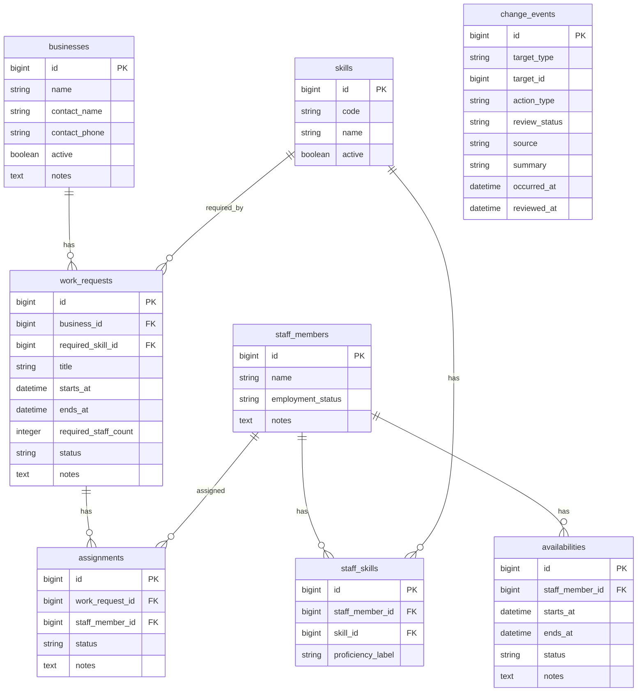

# ER図

共通基盤で使用する主なテーブルと関連を示す。

## 主な制約

- `skills.code`は重複不可
- `assignments`では、勤務依頼とスタッフの組み合わせは重複不可
- `staff_skills`では、スタッフとスキルの組み合わせは重複不可
- 勤務依頼は事業者と必要スキルを参照する
- 変更記録の`target_id`は、`target_type`で示された業務データのIDを保存する
